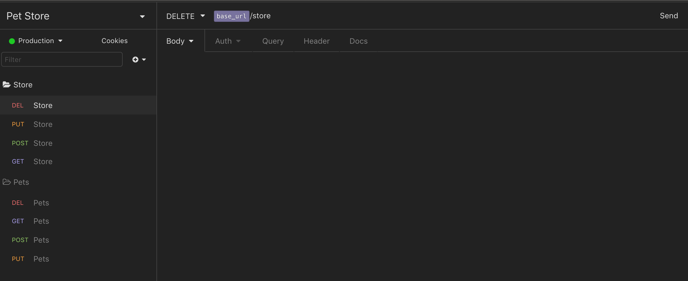

<div align="center">
  
</div>

<br />
<br />

## Description

Generate Swagger Documentation from Insomnia REST Client.
<br />
*This is a fork of [swaggymnia](https://github.com/mlabouardy/swaggymnia) which is now dead.*

## Changelog

`2.0`
 * Open API 3 support
 * Insomnia v4 support
 * New Config Format

## How to use it

See usage with:

```
$ swaggomnia --help
```

Generate Swagger documentation:

```
$ swaggomnia generate -insomnia INSOMNIA_EXPORTED_FILE -config CONFIG_FILE -output FORMAT
```

| Option | Description |
| ------ | ----------- |
| -insomnia | Insomnia exported file |
| -config | API Global Configuration file (see [Configuration Format](#configuration-format))|
| -output | Insomnia output format (json or yaml, default json)  |


## Example

Let's convert the following Insomnia API documentation to Swagger:

<div align="center">
  
</div>

Issue the following command:

```
$ swaggomnia generate -i examples/watchnow.json -c examples/config.json -o json
```

<div align="center">
  
</div>

## Configuration Format

```
{
  "title" : "API Name",
  "version" : "API version",
  "basePath" : "https://api.domain.com/v1",
  "description" : "API description"
}
```

## Maintainers
- Nick Wallace - nwallace@fyberstudios.com - New Author

## License

This project is licensed under the MIT License - see the [LICENSE](LICENSE) file for details
